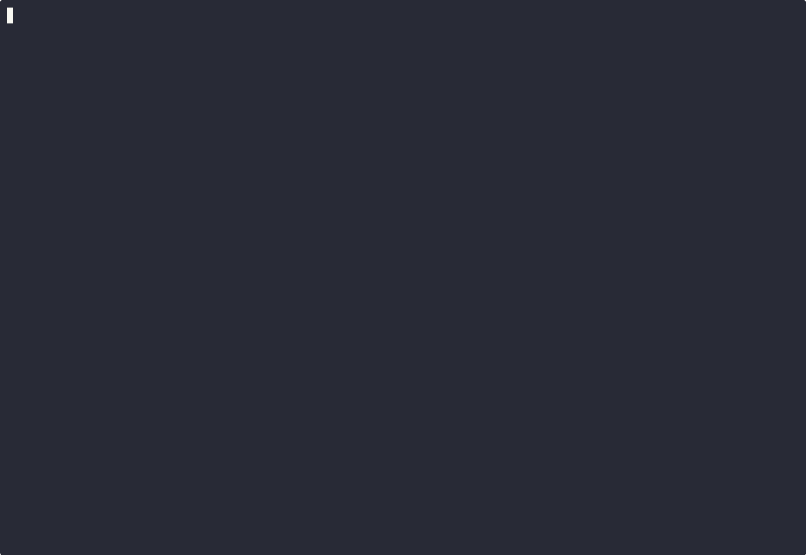

# When TVLA Lies: How a Broken Standard Is Blocking Post-Quantum Crypto Deployment

> **[Read the whitepaper (PDF)](whitepaper.pdf)** | **[Read the whitepaper (Markdown)](WHITEPAPER.md)**

ISO 17825 TVLA (the mandatory side-channel test for FIPS 140-3 certification) produces catastrophic false positives on ML-KEM when run on modern hardware. The root cause is **temporal drift from sequential data collection**, not any weakness in the algorithm or its implementation.

**Headline result:** Switching from sequential to interleaved measurement collection reduces Apple Silicon's |t| from **62.49 to 0.58** (a 100x reduction) with no change to the hardware, software, or cryptographic inputs. Intel x86 shows the same pattern: |t| drops from **6.70 to 1.65**. 12.2 million traces and 150+ experiments confirm zero exploitable bits of secret information.

We release **sca-triage**, an open-source triage tool that distinguishes real side-channel leakage from false positives, and propose a two-stage evaluation protocol for ISO 17825.

---

## Demo

[](https://youtu.be/ntKd9beAb54)

[Watch the full demo on YouTube](https://youtu.be/ntKd9beAb54)

The demo runs a live four-act analysis showing how TVLA produces a catastrophic false positive (score: 62.49) that vanishes (score: 0.58) when measurement collection order is changed. Run it yourself:

```bash
make demo
```

---

## Repository Layout

```
├── WHITEPAPER.md              ← Full paper (Markdown)
├── whitepaper.pdf             ← Full paper (PDF)
├── REPRODUCE.md               ← Step-by-step reproduction guide
│
├── sca-triage/                ← Open-source triage tool (pip installable)
│   ├── sca_triage/            ← Python package source
│   ├── tests/                 ← Unit tests
│   └── examples/              ← Usage examples
│
├── data/                      ← All experimental data (CSV, NPZ, JSON)
├── figures/                   ← Generated figures for the paper
├── scripts/                   ← Analysis scripts and experiment orchestrators
│   └── validate_paper_claims.py  ← Verifies all 28 numerical claims
│
├── harnesses/                 ← C timing measurement harnesses
├── x86-replication/           ← Intel x86 cross-platform replication
├── liboqs-vulnerable/         ← Vulnerable liboqs build (positive control)
│
├── submission/                ← Ancillary submission materials
│   ├── cfp_abstracts.md       ← Conference abstracts
│   └── slide_deck_outline.md  ← Talk outline
│
├── assets/                    ← Demo GIF and media
├── Makefile                   ← install, demo, validate targets
├── Dockerfile                 ← Full reproduction in a container
└── docker-compose.yml
```

## Quick Start

**Prerequisites:** Python 3.10+ and pip.

```bash
git clone https://github.com/asdfghjkltygh/m-series-pqc-timing-leak.git
cd m-series-pqc-timing-leak
pip3 install -e sca-triage
```

### 1. Verify All Claims (30 seconds)

```bash
python3 scripts/validate_paper_claims.py
```

Checks all 28 numerical claims in the paper against the data files in the repo. Expected: **28/28 PASS**.

### 2. Run the Tool on Our Data

```bash
# Quick TVLA check (Stage 1 only)
sca-triage analyze --timing-data data/tvla_traces.npz --targets sk_lsb --quick

# Full three-stage pipeline (TVLA + pairwise + MI → FALSE_POSITIVE)
python3 scripts/dudect_comparison.py
```

### 3. Run the Live Demo

```bash
sca-triage demo --timing-data data/raw_timing_traces_v3.csv \
  --vuln-data data/raw_timing_traces_vuln.csv \
  --targets sk_lsb --precomputed --dark
```

Add `--fast` to skip animations.

### 4. Full Reproduction (Docker)

```bash
docker-compose up --build run-all-experiments
```

Runs all experiments (~7 minutes), validates all claims, outputs results to `data/` and `figures/`. See [REPRODUCE.md](REPRODUCE.md) for details.

## Key Results

| Collection | Platform | |t| | Verdict |
|-----------|----------|-----|---------|
| Sequential | Apple Silicon | 62.49 | **FAIL** |
| Interleaved | Apple Silicon | 0.58 | **PASS** |
| Sequential | Intel x86 | 6.70 | **FAIL** |
| Interleaved | Intel x86 | 1.65 | **PASS** |

Same hardware. Same code. Same inputs. The only difference is *when* the measurements were collected.

## License

sca-triage is released under the MIT License. See [sca-triage/LICENSE](sca-triage/LICENSE).
